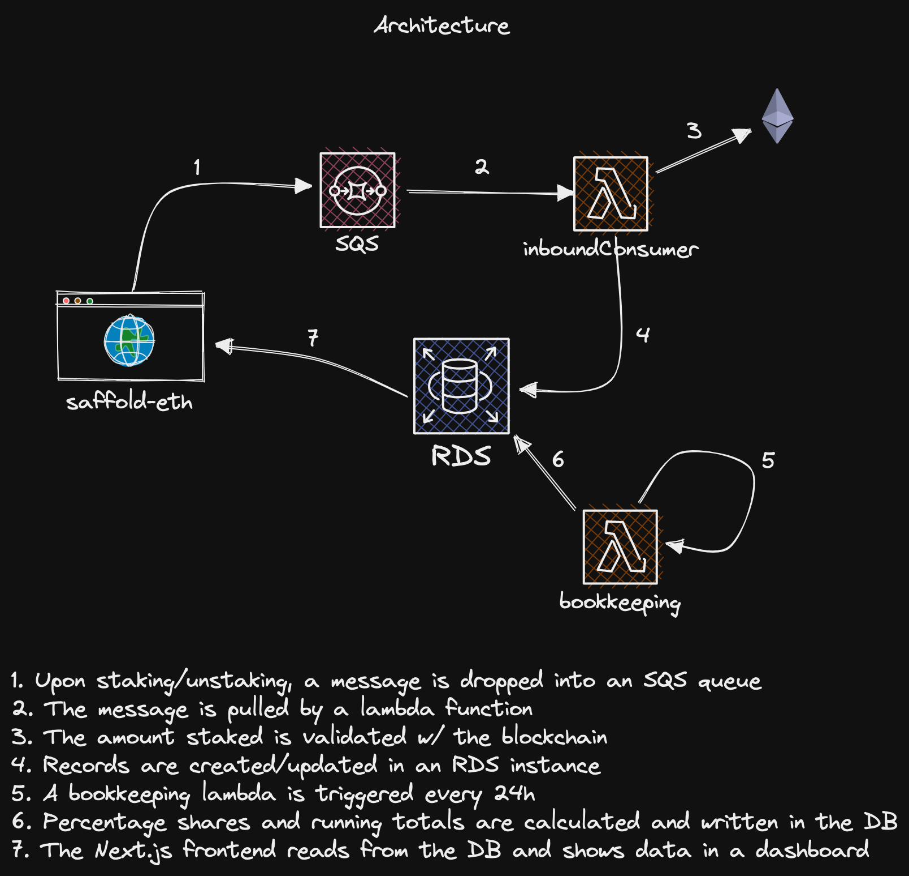

# Spork Staking v2

This build is based off of scaffold-eth 2. In addition it uses [sst.dev](https://sst.dev) to manage the infrastructure and deployments to AWS.

## Architecture

## Secret Manager Setup

The following values have to be set by the user in the AWS Secret Manager:

- `POLYGON_ALCHEMY_KEY`
- `SSPORK_ADDRESS`
- `NEXT_PUBLIC_WHITELISTED_ADDRESSES`

Use:

`npx sst secrets set VARIABLE_NAME VARIABLE_VALUE`

Example:

`npx sst secrets set POLYGON_ALCHEMY_KEY 1234567890`

Note that `NEXT_PUBLIC_WHITELISTED_ADDRESSES` is a comma separated list of addresses. Example:

`npx sst secrets set NEXT_PUBLIC_WHITELISTED_ADDRESSES 0x1234567890,0x0987654321`

## Contract ownership

The contract owner address is: 0x496E5dA3A13215e95351091a9aeCe295a3569e84

Deploy scripts are based off of [this](https://www.npmjs.com/package/@openzeppelin/hardhat-upgrades) and will need to be upgraded accordingly when upgrading the contracts.

## Contract Addresses

StakedSpork deployed to: 0x9f15F3EB43D16eC7a0398eb84e762163b56faAA3
SporkStaker deployed to: 0xEe1bb9DAcb1067aFDD79733F6d6402D5bD47663d
The Spork token is deployed at: 0x9CA6a77C8B38159fd2dA9Bd25bc3E259C33F5E39
